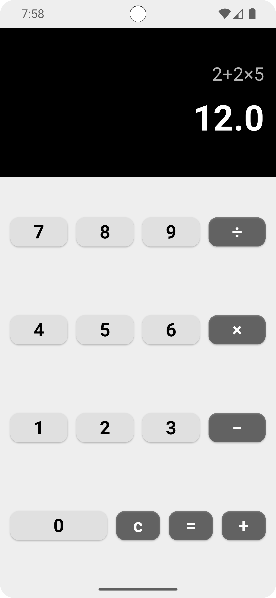

# Calculator Flutter App

A clean and simple calculator application built with Flutter that performs basic arithmetic operations.

## 📱 Overview

This is a mobile calculator app with a minimalist design that supports the four fundamental arithmetic operations: addition, subtraction, multiplication, and division. The app features a user-friendly interface with a clear display and responsive buttons.

## 📱 ScreenShots
|:------------------------------:|:-----------------------------:|
|  |  |

## ✨ Features

- **Basic Arithmetic Operations**: Addition (+), Subtraction (−), Multiplication (×), and Division (÷)
- **Clear Display**: Shows both the expression being entered and the calculated result
- **Clean Interface**: Modern UI with a black display panel and intuitive button layout
- **Error Handling**: Displays "Error" for invalid expressions
- **Clear Function**: Reset button (C) to clear the current calculation
- **Responsive Design**: Adapts to different screen sizes

## 🎯 Task Requirements Compliance

✅ Single screen with number buttons (0-9)  
✅ Basic operation buttons (+, -, ×, ÷)  
✅ Display for input and result  
✅ Supports addition, subtraction, multiplication, and division  
✅ Clean, functional implementation without advanced features

## 🏗️ Project Structure

```
calculator_flutter_app/
├── lib/
│   ├── main.dart           # App entry point
│   ├── calc_view.dart      # UI/View layer (Calculator screen)
│   └── calc_logic.dart     # Business logic (Calculation engine)
├── android/                # Android-specific files
├── ios/                    # iOS-specific files
├── test/                   # Test files
├── pubspec.yaml           # Project dependencies
└── README.md              # This file
```

## 🧩 Architecture

The app follows a clean separation of concerns:

- **View Layer** (`calc_view.dart`): Handles UI rendering and user interactions
- **Logic Layer** (`calc_logic.dart`): Processes calculations using the `math_expressions` package
- **Main** (`main.dart`): App initialization and routing

## 🚀 Getting Started

### Prerequisites

- Flutter SDK (3.10.1 or higher)
- Dart SDK (3.10.1 or higher)
- Android Studio / Xcode (for mobile deployment)
- A physical device or emulator

### Installation

1. **Clone the repository**
   ```bash
   git clone https://github.com/ahmedasaber/calculator_flutter_app
   cd calculator_flutter_app
   ```

2. **Install dependencies**
   ```bash
   flutter pub get
   ```

3. **Run the app**
   ```bash
   flutter run
   ```

## 📦 Dependencies

- **flutter**: SDK for building the app
- **math_expressions** (^2.4.0): Parser and evaluator for mathematical expressions
- **cupertino_icons** (^1.0.8): iOS-style icons

## 🎨 UI Design

### Display Section
- **Expression Display**: Shows the current mathematical expression (white70 color, 24px)
- **Result Display**: Shows the calculated result (white, 48px, bold)
- **Background**: Black background for high contrast

### Button Layout
```
7  8  9  ÷
4  5  6  ×
1  2  3  −
0  0  C  =  +
```

- **Number Buttons**: Light gray background (Colors.grey[300])
- **Operator Buttons**: Dark gray background (Colors.black45)
- **Rounded Corners**: 12px border radius for modern look

## 💡 How It Works

1. **Input**: User taps number and operator buttons
2. **Expression Building**: Input is concatenated into a mathematical expression
3. **Calculation**: When "=" is pressed:
    - Operators are converted to standard format (× → *, ÷ → /, − → -)
    - Expression is parsed using `math_expressions` package
    - Result is evaluated and displayed
4. **Clear**: "C" button resets expression and result to initial state

## 🧪 Testing

Run the test suite:
```bash
flutter test
```

## 📱 Platform Support

- ✅ Android (API 21+)
- ✅ iOS (13.0+)

## 🔧 Build & Deploy

### Android
```bash
flutter build apk --release
```

### iOS
```bash
flutter build ios --release
```

## 📄 License

This project is created for educational purposes as part of a mobile development task.

---

## 🔗 Download & Try

[Calculator APK](release/app-arm64-v8a-release.apk)

---